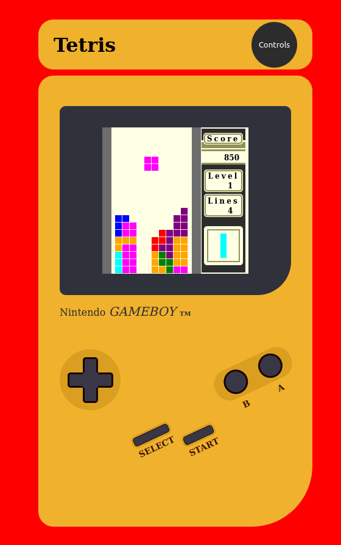

# JS_Tetris

View the project live [here](https://brenton-j-andrews.github.io/JS_Tetris/).

----
#### About this project.

A Tetris clone complete with Gameboy-esque styling and mobile support! The game is uncompleted at the moment, but is 99% of the way there.

All game logic, functions and styling authored by me. Only external resourses used were the [Tetris wiki](https://tetris.wiki/Tetris_(Game_Boy)) (as noted in code comments) and [this](https://www.reddit.com/r/Tetris/comments/6o6tvv/what_is_the_block_algorithm_for_classic_tetris/) Reddit thread.

##### TODO:
- Remove test lines.
- Mobile: fix CSS colors and increase control sizes for ease of use.
- Mobile: Add downpressed button functionality (ex: continuously rotate piece while B button is pressed).
- Add support for simultaneous button / key presses. The game becomes unplayable on desktop after level 10 (for me anyway) without this.
- Add support for high scores. A little harder to achieve in vanilla JS compared to using a Node package.
- Add pause button.
- Add "Select" button events. Currently doesn't do anything.
- Implement a "7-bag" randomizer? This version uses a very simple randomizer that has slight bias against selecting the same piece twice, as supposedly found in the NES version of the game.
- Create a patterned backround.

----
#### Frameworks.

This project was built using vanilla Javascript, HTML and CSS. I needed a review, its been a while!

----
#### Takaways.

I enjoy solving problems on real projects that would fit in on a site like Leetcode. This project had a few examples, like rotating a 2d matrix 90 degrees or figuring out 
valid tetromino placement. 

One thought that I had continously while making this game was what an optimized implementation would look like, guess I can find out now. Upon placing a tetromino 
in my implementation, the program uses 6 for-loops. The inputs for each loop are very small (20, 10, 4 or 3) but I kept thinking about
the difference between O(n) and O(n^2).
